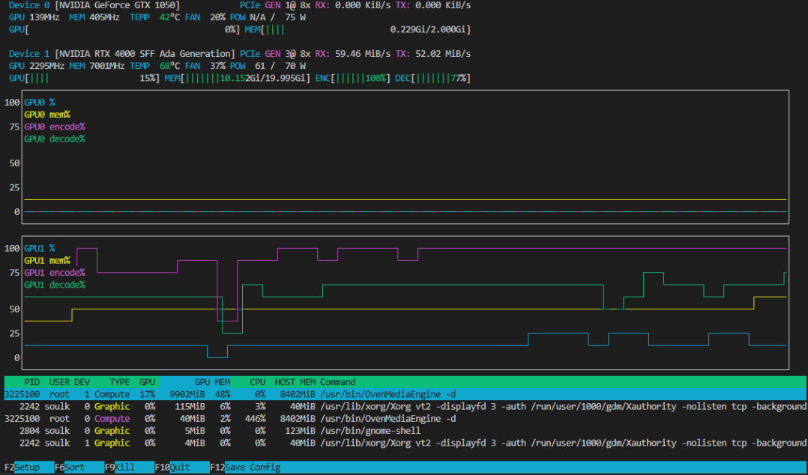

# OvenMediaEngine Stress Tester

## Overview

**OvenMediaEngine Stress Tester** is an automated tool that allows developers to:
- **Quickly obtain precise performance metrics for OvenMediaEngine across different hardware** 
- **Easily validate service stability and scalability with reliable test data** 

This stress tester do:

1. Starts an HTTP callback server to receive alerts from OvenMediaEngine.
2. Launches a configured number or an unlimited number of FFmpeg processes at a specified interval to stream to OvenMediaEngine.
3. Monitors for the specific alert come from OvenMediaEngine.
4. When an alert callback related to performance is detected, it is logged and reported to the user.
5. This allows the user to check performance.

---

## Prerequisites

### OvenMediaEngine

- The **[OvenMediaEngine Enterprise](https://airensoft.com/ome-enterprise.html)** Edition is required.
  - Uses the [Enhanced Alert](https://docs.enterprise.ovenmediaengine.com/guide/operations-and-monitoring/enhanced-alert) feature of OvenMediaEngine Enterprise.
  - If you’re interested in the OvenMediaEngine Enterprise Edition, please [contact us](https://airensoft.com/contact.html).
- OvenMediaEngine must be pre-configured to send alerts to the tester's host.
- OvenMediaEngine needs a pre-configured encoding profile in the target Application to test.

### Stress Tester App

- Python 3.6 or higher is required.
  - Please check the Python version by running either python -V or python3 -V.
- FFmpeg must be installed and executable.
  - Please check the FFmpeg installed by running either ffmpeg -version or path/to/ffmpeg/ffmpeg -version.
- A Video file to stream to OvenMediaEngine must be prepared.
  - We provide a sample video for the stress tester: sample-video.mp4  (1080p, 30 fps, 5 Mbps).

---

## Project Structure

Clone the project from https://github.com/AirenSoft/OMEStressTester , you will find the following files.

```
OMEStressTester/
├── OMEStressTester.py      # Main stress tester script
├── config.ini              # Configuration file for test parameters
├── sample-video.mp4        # Sample video file for streaming
├── Server.xml              # Sample OME Server.xml
```

---

## Stress Tester Configuration

Edit the `config.ini` file to customize the test parameters:

``` python
[Server]
# Port for receiving OvenMediaEngine alert callbacks
# The endpoint of the alert callback server is fixed as http://your_test_app_host:alert_callback_server_port/callback
alert_callback_server_port = 8080

[Stream]
# Maximum number of FFmpeg executions. Set to 0 for unlimited executions.
max_ffmpeg_execution_count = 0

# Interval (in seconds) between starting each FFmpeg stream
ffmpeg_execution_interval = 20

# FFmpeg command template for RTMP streaming to OvenMediaEngine.
# Use ${seq} as a placeholder for stream sequence number.
# The tester will execute the command by incrementing ${seq} from 0 by 1 each time.
# Make sure to verify the OvenMediaEngine address (host, port, app name).

# Example for RTMP:
ffmpeg_command = ffmpeg -re -stream_loop -1 -i sample-video.mp4 -c copy -f flv rtmp://localhost:1935/app/stream_${seq}

# Example for SRT:
# ffmpeg_command = ffmpeg -re -stream_loop -1 -i sample-video.mp4 -c copy -f mpegts srt://localhost:9999?streamid=default/app/stream_${seq}
```

## OvenMediaEngine Configuration

Configure OvenMediaEngine to send alerts to the stress tester. Add the `<InternalQueueCongestion><Egress><StreamStatus>` rule to your Alert configuration:

Pre-configure the output profile to test. (Added full Server.xml)

``` xml
<?xml version="1.0" encoding="UTF-8"?>

<Server version="8">
  <Name>OvenMediaEngine</Name>
  <Type>origin</Type>
  <IP>*</IP>
  <PrivacyProtection>false</PrivacyProtection>

  <StunServer>stun.ovenmediaengine.com:13478</StunServer>

  <Modules>
    <!-- 
    Currently OME only supports h2 like all browsers do. Therefore, HTTP/2 only works on TLS ports.			
    -->
    <HTTP2>
      <Enable>true</Enable>
    </HTTP2>

    <LLHLS>
      <Enable>true</Enable>
    </LLHLS>

    <!-- P2P works only in WebRTC and is experiment feature -->
    <P2P>
      <!-- disabled by default -->
      <Enable>false</Enable>
      <MaxClientPeersPerHostPeer>2</MaxClientPeersPerHostPeer>
    </P2P>
  </Modules>

  <!-- Settings for the ports to bind -->
  <Bind>
    <Managers>
      <API>
        <Port>8081</Port>
        <WorkerCount>1</WorkerCount>
      </API>
    </Managers>
    <Providers>
      <!-- Push providers -->
      <RTMP>
        <Port>1935</Port>
        <WorkerCount>1</WorkerCount>
      </RTMP>
    </Providers>

    <Publishers>
      <LLHLS>
        <Port>3333</Port>
        <WorkerCount>1</WorkerCount>
      </LLHLS>
    </Publishers>
  </Bind>

  <Managers>
    <Host>
      <Names>
        <Name>*</Name>
      </Names>
    </Host>
    <API>
      <AccessToken>ome:default</AccessToken>
      <CrossDomains>
        <Url>*</Url>
      </CrossDomains>
    </API>
  </Managers>
  
  <Alert>
    <Url>http://localhost:8080/callback</Url>
    <SecretKey></SecretKey>
    <Timeout>3000</Timeout>
    <Rules>
      <InternalQueueCongestion />
      <Egress>
        <StreamStatus />
      </Egress>
    </Rules>
</Alert>
  
<VirtualHosts>
    <!-- You can use wildcard like this to include multiple XMLs -->
    <VirtualHost include="VHost*.xml" />
    <VirtualHost>
      <Name>default</Name>
      <Distribution>ovenmediaengine.com</Distribution>

      <!-- Settings for multi ip/domain and TLS -->
      <Host>
        <Names>
          <Name>*</Name>
        </Names>
      </Host>

      <!-- Default CORS Settings -->
      <CrossDomains>
        <Url>*</Url>
      </CrossDomains>

      <!-- Settings for applications -->
      <Applications>
        <Application>
          <Name>app</Name>
          <!-- Application type (live/vod) -->
          <Type>live</Type>
          <OutputProfiles>

            <!-- Common setting for decoders. Decodes is optional. -->

            <!-- <Decodes>
              <ThreadCount>2</ThreadCount>
              <OnlyKeyframes>false</OnlyKeyframes>
            </Decodes> -->

            <!-- Enable this configuration if you want to hardware acceleration using GPU -->
            <HWAccels>
              <Decoder>
                <Enable>true</Enable>
                <Modules>nv:0</Modules>
              </Decoder>
              <Encoder>
                <Enable>true</Enable>
                <Modules>nv:0</Modules>
              </Encoder>
            </HWAccels>

            <OutputProfile>
              <Name>default</Name>
              <OutputStreamName>${OriginStreamName}</OutputStreamName>
              <Encodes>
                <Video>
                  <Name>video_1080</Name>
                  <Codec>h264</Codec>
                  <Bitrate>5024000</Bitrate>
                  <Width>1920</Width>
                  <Height>1080</Height>
                  <Framerate>30</Framerate>
                  <KeyFrameInterval>30</KeyFrameInterval>
                  <BFrames>0</BFrames>
                  <Preset>faster</Preset>
                </Video>
                <Audio>
                  <Name>aac_audio</Name>
                  <Codec>aac</Codec>
                  <Bitrate>128000</Bitrate>
                  <Samplerate>48000</Samplerate>
                  <Channel>2</Channel>
                  <BypassIfMatch>
                    <Codec>eq</Codec>
                  </BypassIfMatch>
                </Audio>
              </Encodes>
            </OutputProfile>
          </OutputProfiles>
          <Providers>
            <RTMP />
          </Providers>
          <Publishers>
            <AppWorkerCount>1</AppWorkerCount>
            <StreamWorkerCount>8</StreamWorkerCount>
            <LLHLS>
              <ChunkDuration>1</ChunkDuration>
              <!-- <PartHoldBack> SHOULD be at least three times the <ChunkDuration> -->
              <PartHoldBack>3</PartHoldBack>
              <SegmentDuration>6</SegmentDuration>
              <SegmentCount>10</SegmentCount>
              <CrossDomains>
                <Url>*</Url>
              </CrossDomains>
            </LLHLS>
          </Publishers>
        </Application>
      </Applications>
    </VirtualHost>
  </VirtualHosts>
</Server>
```

---

## Usage

Running the Stress Tester. 

1. Set the `expected max_ffmpeg_execution_count` and an appropriate `ffmpeg_execution_interval` in the `config.ini` file.
2. Run a stress tester with the following command.
3. To stop the process send a SIGINT (interrupt) signal by pressing `Ctrl + C`.

``` shell
python OMEStressTester.py

or 

python3 OMEStressTester.py
```

### Test Method

The tester will display At Startup:

``` shell
============================================================
Stress Tester for OvenMediaEngine v1.0.0
============================================================
Configuration:
  - Log File: ome-stress-tester.log
  - Alert Callback Server Port: 8080
  - Max FFmpeg Execution Count: 0
  - FFmpeg Execution Interval: 10 seconds
  - FFmpeg Command: ffmpeg -re -stream_loop -1 -i input.mp4 -c copy -f flv rtmp://localhost:54935/app/stream_${seq}
============================================================
Alert callback server running on port 8080
Execute FFmpeg. seq: 0, cmd: ffmpeg -re -stream_loop -1 -i input.mp4 -c copy -f flv rtmp://localhost:54935/app/stream_0
Execute FFmpeg. seq: 1, cmd: ffmpeg -re -stream_loop -1 -i input.mp4 -c copy -f flv rtmp://localhost:54935/app/stream_1
```

When alert callback related to performance is detected:

**case 1**: If one of the following messages is found, it can be determined that no further streams will be created and it has reached its performance limit.
- EGRESS_STREAM_CREATION_FAILED_BY_OUTPUT_PROFILE
- EGRESS_STREAM_CREATION_FAILED_BY_DECODER
- EGRESS_STREAM_CREATION_FAILED_BY_ENCODER
- EGRESS_STREAM_CREATION_FAILED_BY_FILTER

In this case 8 streams are ok.
- This is the actual test result using our NVIDIA GeForce GTX 1050.

``` shell
Execute FFmpeg. seq:  6, cmd: ffmpeg -re -stream_loop -1 -i sample-video.mp4 -c copy -f flv rtmp://localhost:1935/app/stream_5
Execute FFmpeg. seq:  7, cmd: ffmpeg -re -stream_loop -1 -i sample-video.mp4 -c copy -f flv rtmp://localhost:1935/app/stream_6
Execute FFmpeg. seq:  8, cmd: ffmpeg -re -stream_loop -1 -i sample-video.mp4 -c copy -f flv rtmp://localhost:1935/app/stream_7
Execute FFmpeg. seq:  9, cmd: ffmpeg -re -stream_loop -1 -i sample-video.mp4 -c copy -f flv rtmp://localhost:1935/app/stream_8
                ! WARNING: EGRESS - EGRESS_STREAM_CREATION_FAILED_BY_ENCODER. Failed to create egress stream because the encoder could not be created
Execute FFmpeg. seq: 10, cmd: ffmpeg -re -stream_loop -1 -i sample-video.mp4 -c copy -f flv rtmp://localhost:1935/app/stream_9
                ! WARNING: EGRESS - EGRESS_STREAM_CREATION_FAILED_BY_ENCODER. Failed to create egress stream because the encoder could not be created
Execute FFmpeg. seq: 11, cmd: ffmpeg -re -stream_loop -1 -i sample-video.mp4 -c copy -f flv rtmp://localhost:1935/app/stream_10
Execute FFmpeg. seq: 12, cmd: ffmpeg -re -stream_loop -1 -i sample-video.mp4 -c copy -f flv rtmp://localhost:1935/app/stream_11
...
```

**case 2**: If the INTERNAL_QUEUE_CONGESTION event continues to occur, it can be determined that the system has reached its performance limit.

In this case 49 streams are ok.
- This is the actual test result using our NVIDIA RTX 4000 SFF Ada Generation.

``` shell
Execute FFmpeg. seq: 42, cmd: ffmpeg -re -stream_loop -1 -i sample-video.mp4 -c copy -f flv rtmp://localhost:1935/app/stream_41
Execute FFmpeg. seq: 43, cmd: ffmpeg -re -stream_loop -1 -i sample-video.mp4 -c copy -f flv rtmp://localhost:1935/app/stream_42
Execute FFmpeg. seq: 44, cmd: ffmpeg -re -stream_loop -1 -i sample-video.mp4 -c copy -f flv rtmp://localhost:1935/app/stream_43
Execute FFmpeg. seq: 45, cmd: ffmpeg -re -stream_loop -1 -i sample-video.mp4 -c copy -f flv rtmp://localhost:1935/app/stream_44
Execute FFmpeg. seq: 46, cmd: ffmpeg -re -stream_loop -1 -i sample-video.mp4 -c copy -f flv rtmp://localhost:1935/app/stream_45
Execute FFmpeg. seq: 47, cmd: ffmpeg -re -stream_loop -1 -i sample-video.mp4 -c copy -f flv rtmp://localhost:1935/app/stream_46
Execute FFmpeg. seq: 48, cmd: ffmpeg -re -stream_loop -1 -i sample-video.mp4 -c copy -f flv rtmp://localhost:1935/app/stream_47
Execute FFmpeg. seq: 49, cmd: ffmpeg -re -stream_loop -1 -i sample-video.mp4 -c copy -f flv rtmp://localhost:1935/app/stream_48
Execute FFmpeg. seq: 50, cmd: ffmpeg -re -stream_loop -1 -i sample-video.mp4 -c copy -f flv rtmp://localhost:1935/app/stream_49
                !WARNING: INTERNAL_QUEUE - INTERNAL_QUEUE_CONGESTION. Internal queue(s) is currently congested
Execute FFmpeg. seq: 51, cmd: ffmpeg -re -stream_loop -1 -i sample-video.mp4 -c copy -f flv rtmp://localhost:1935/app/stream_50
Execute FFmpeg. seq: 52, cmd: ffmpeg -re -stream_loop -1 -i sample-video.mp4 -c copy -f flv rtmp://localhost:1935/app/stream_51
Execute FFmpeg. seq: 53, cmd: ffmpeg -re -stream_loop -1 -i sample-video.mp4 -c copy -f flv rtmp://localhost:1935/app/stream_52
Execute FFmpeg. seq: 54, cmd: ffmpeg -re -stream_loop -1 -i sample-video.mp4 -c copy -f flv rtmp://localhost:1935/app/stream_53
                !WARNING: INTERNAL_QUEUE - INTERNAL_QUEUE_CONGESTION. Internal queue(s) is currently congested
Execute FFmpeg. seq: 55, cmd: ffmpeg -re -stream_loop -1 -i sample-video.mp4 -c copy -f flv rtmp://localhost:1935/app/stream_54
                !WARNING: INTERNAL_QUEUE - INTERNAL_QUEUE_CONGESTION. Internal queue(s) is currently congested
                !WARNING: INTERNAL_QUEUE - INTERNAL_QUEUE_CONGESTION. Internal queue(s) is currently congested
                !WARNING: INTERNAL_QUEUE - INTERNAL_QUEUE_CONGESTION. Internal queue(s) is currently congested
                !WARNING: INTERNAL_QUEUE - INTERNAL_QUEUE_CONGESTION. Internal queue(s) is currently congested
                !WARNING: INTERNAL_QUEUE - INTERNAL_QUEUE_CONGESTION. Internal queue(s) is currently congested
                !WARNING: INTERNAL_QUEUE - INTERNAL_QUEUE_CONGESTION. Internal queue(s) is currently congested
                !WARNING: INTERNAL_QUEUE - INTERNAL_QUEUE_CONGESTION. Internal queue(s) is currently congested
                !WARNING: INTERNAL_QUEUE - INTERNAL_QUEUE_CONGESTION. Internal queue(s) is currently congested
                !WARNING: INTERNAL_QUEUE - INTERNAL_QUEUE_CONGESTION. Internal queue(s) is currently congested
                !WARNING: INTERNAL_QUEUE - INTERNAL_QUEUE_CONGESTION. Internal queue(s) is currently congested
                !WARNING: INTERNAL_QUEUE - INTERNAL_QUEUE_CONGESTION. Internal queue(s) is currently congested
                !WARNING: INTERNAL_QUEUE - INTERNAL_QUEUE_CONGESTION. Internal queue(s) is currently congested
                !WARNING: INTERNAL_QUEUE - INTERNAL_QUEUE_CONGESTION. Internal queue(s) is currently congested
                !WARNING: INTERNAL_QUEUE - INTERNAL_QUEUE_CONGESTION. Internal queue(s) is currently congested
                !WARNING: INTERNAL_QUEUE - INTERNAL_QUEUE_CONGESTION. Internal queue(s) is currently congested
                !WARNING: INTERNAL_QUEUE - INTERNAL_QUEUE_CONGESTION. Internal queue(s) is currently congested
...
```

This is the **nvtop** monitoring result from the test above. Monitoring with nvtop can be helpful.



## Monitored Alert Messages for performance test

Find more details in this [Document](https://docs.enterprise.ovenmediaengine.com/guide/operations-and-monitoring/enhanced-alert#messages).

- INTERNAL_QUEUE_CONGESTION
- EGRESS_STREAM_CREATION_FAILED_BY_OUTPUT_PROFILE
- EGRESS_STREAM_CREATION_FAILED_BY_DECODER
- EGRESS_STREAM_CREATION_FAILED_BY_ENCODER
- EGRESS_STREAM_CREATION_FAILED_BY_FILTER

---

## Log File

Log is saved to `ome-stress-tester.log` in the project directory. The log includes:

- Configuration at startup
- Each FFmpeg stream start with full command
- All Alert callbacks received with payload
- Test results summary
- Any errors encountered
